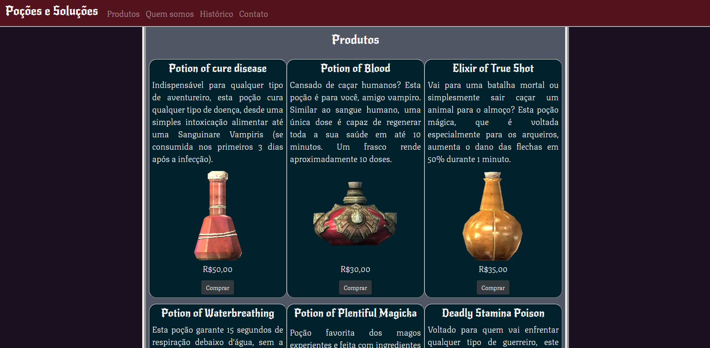
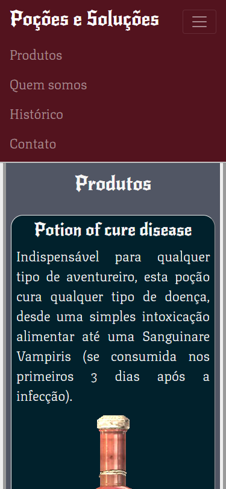
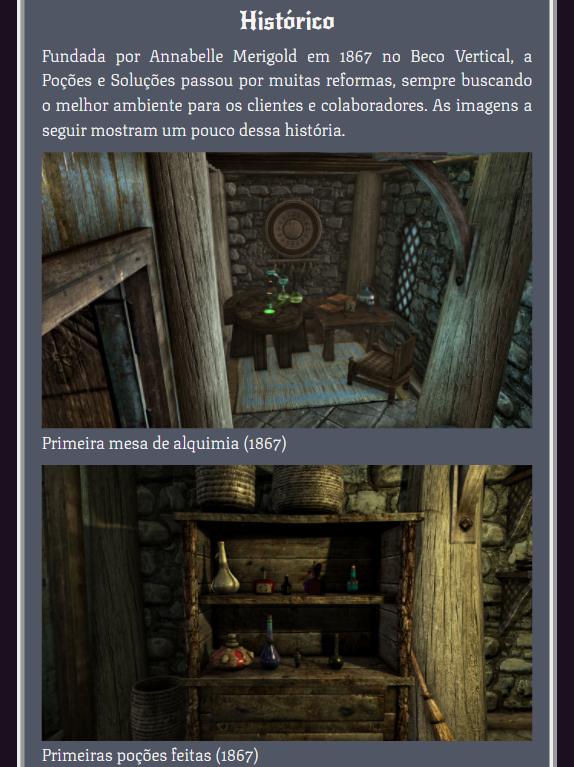

# **Poções e Soluções**​ :alembic:

   

## Sobre

Página construída com [HTML](https://developer.mozilla.org/pt-BR/docs/Web/HTML), [CSS](https://developer.mozilla.org/pt-BR/docs/Web/CSS), [JS](https://developer.mozilla.org/pt-BR/docs/Web/JavaScript) e [Bootstrap](https://getbootstrap.com/) durante uma atividade da faculdade. A *Poções e Soluções* é uma loja fictícia que vende poções. Com a pandemia de COVID-19, as vendas da loja caíram, então a cliente decidiu investir em um website de vendas. A página foi desenvolvida seguindo algumas exigências da cliente, como:

- Uma descrição da loja.
- Uma seção de histórico com fotos.
- Um rodapé com informações de contato.
- Uma seção com os produtos disponíveis.
- Utilizar fontes medievais clássicas.
- Paleta de cores escuras.
- Site responsivo.
- Menu de navegação.
- Utilizar uma API para recuperar dados de produtos (enquanto estiverem disponíveis).

## Como utilizar

De modo mais simples, basta abrir o arquivo *index.html* no seu navegador web.